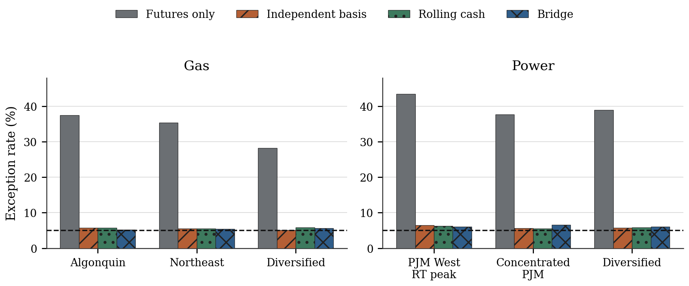
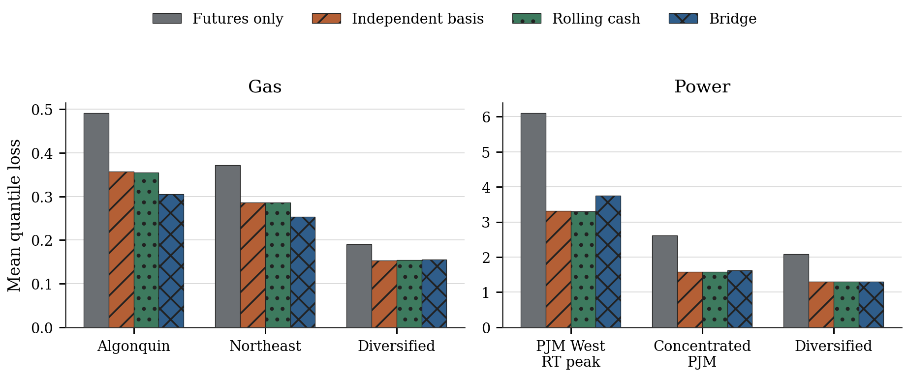
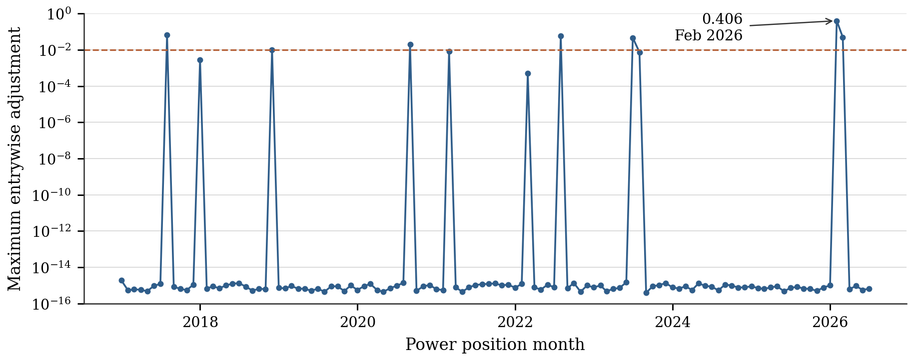
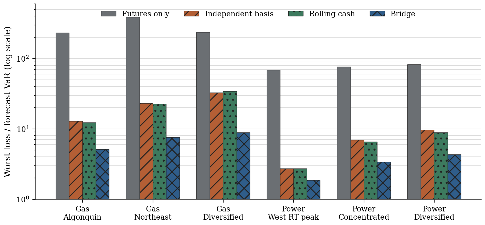

**JEL classification:** C14, C53, G17, Q40

# Introduction

A historical Value-at-Risk model is only as relevant as the shocks applied to
the position being measured. For a monthly natural-gas or power position, the
economic exposure may be a physical cash index, a location-specific settlement,
or an hourly delivery block. The longest and most liquid history, however, often
belongs to a benchmark futures contract. Replacing the cash risk factor with that
future is operationally attractive and economically incomplete. The replacement
suppresses the basis between the traded hedge and the position that ultimately
settles.

This distinction is particularly important in the cash month. Location
constraints, weather, outages, fuel availability, day-ahead versus real-time
market design, and the changing scarcity of transport or generation can move a
cash index far more than its mapped monthly future. Supervisory guidance has long
identified product, location, grade, and delivery-date mismatches as distinct
commodity basis risks [@federalreserve2009]. Yet a risk manager who asks for one
year of daily shocks before a future delivery month faces a practical obstacle:
the desired cash month has not happened. The history required for a conventional
historical simulation does not exist in calendar form.

The proposed solution is a *factor-conditioned moment-matched bridge*. It starts
with the observed history of the liquid futures factors for the target contract,
calibrates how cash changes co-move with those factors in comparable prompt
windows, generates cross-sectionally correlated residual changes, and conditions
the resulting path on observed cash endpoints. The endpoint adjustment has the
same algebra as a discrete Brownian bridge. It does not assume that commodity
prices follow continuous Brownian motion, nor does it infer a risk-neutral price.
It is a finite-sample scenario transformation for historical VaR.

A larger VaR is not, by itself, evidence of a better model. Any sufficiently
dispersed scenario set can reduce exceptions or worst-loss-to-VaR ratios. The
scientific question is whether the dispersion arises from the economic structure
of the exposure. For a cash position and its hedge factor, that requires the
observed target-factor history, the calibrated cash-factor response, and the
cross-location residual dependence to appear together in one synchronized
scenario matrix. Portfolio risk then follows from that structure rather than
from an arbitrary volatility addition.

The central question is not whether the constructed columns look plausible in
isolation. It is whether a scenario matrix preserves the original cash-to-factor
and cash-to-cash dependence relevant to portfolio loss while remaining
point-in-time valid. The construction therefore imposes three exact sample
conditions on the residual matrix: zero mean, orthogonality to the factor matrix,
and a feasible target residual covariance. A final constant shift by series meets
the cash endpoint without changing any centered covariance or correlation. This
directly addresses factor double counting: systematic variation enters once,
through the mapped futures factors, while residual variation is explicitly
orthogonal to those factors.

The paper makes six contributions.

1. It formulates the missing cash-month history problem as conditional scenario
   generation rather than as an unconditional extrapolation of spot prices.
2. It gives a one-factor gas construction and a mapped multi-factor power
   construction in a common matrix notation.
3. It states the finite-sample invariants and feasibility conditions, including
   the role of positive-semidefinite projection when independently estimated
   moments are incompatible.
4. It measures structural fidelity across 115 gas vintages using mapped-factor,
   cash-correlation, and residual-correlation matrix errors, including
   dependence-aware bootstrap intervals.
5. It compares the proposal with futures-only shocks, an exact empirical
   convolution of futures and independently paired basis changes, and a rolling
   historical cash proxy in leakage-free monthly VaR backtests.
6. It examines Winter Storm Fern in January 2026 and separates supported
   risk-budget counterfactuals from unsupported claims about hedge-fund survival.

The structural result is stronger than the VaR ranking. In the complete gas
scenario output, median residual-correlation RMSE is 0.0058 for the bridge,
compared with 0.2570 for independent basis and 0.2617 for rolling cash. The
bridge has lower residual-, cash-, and factor-structure error in all 115 gas
vintages. Across six test portfolios, average bridge VaR is 9.6 to 21.8 times
futures-only VaR, and futures-only exception rates range from 28.2 to 43.4
percent against a nominal 5 percent. Yet rolling cash and independent basis are
competitive, and sometimes superior, in quantile loss. This distinction is
central: the bridge demonstrably follows its calibrated joint risk structure;
whether that estimated structure is the best forecast of a particular tail
quantile is a separate empirical question.

# Motivation and Related Literature

## Why futures can miss cash-month risk

Commodity futures summarize expectations and risk premia for delivery over a
specified contract period. Cash exposures retain additional dimensions. In gas,
pipeline constraints and regional weather produce location basis. In power,
non-storability, transmission congestion, unit outages, and hourly load create
large differences across nodes, zones, market stages, and delivery blocks.
Classical commodity models emphasize mean reversion, convenience yield, and term
structure [@schwartz1997]. Electricity research adds pronounced seasonality,
spikes, and delivery-period structure [@lucia2002]. Those features make a generic
monthly future a useful factor but an unreliable complete proxy.

The public specifications illustrate the distinction. The ICE Henry LD1 contract
(`H`) is a monthly cash-settled future based on the NYMEX Henry Hub settlement,
with a 2,500 MMBtu contract size and a last trading day three business days before
the contract period [@icehenry2026]. The PJM Western Hub real-time peak contract
(`PMI`) settles to the average of published Western Hub real-time LMPs for hours
ending 0800 through 2300 Eastern Prevailing Time on Monday through Friday,
excluding NERC holidays [@icepjm2026]. A position in PJM PPL Zone day-ahead
off-peak power is exposed to a different location, market stage, and block even
when regional factors move together.

The basis omitted by futures-only VaR is not a statistical nuisance. It is the
economic residual left after the hedge factor moves. If cash change for series
$i$ is $\Delta S_{i,t}$ and its mapped futures change is $\Delta F_{m(i),t}$,
then the simple basis change is

\begin{equation}
\Delta b_{i,t}=\Delta S_{i,t}-\Delta F_{m(i),t}.
\label{eq:basis}
\end{equation}

Treating $\Delta b_{i,t}$ as zero makes the hedge perfect by assumption. Sampling
it independently preserves a marginal basis distribution but loses any
factor-basis dependence. Reusing rolling cash changes preserves observed joint
moves but may represent the wrong contract state, season, or delivery block for
the future position month. The proposed bridge is designed between these two
shortcuts.

## Historical simulation and forecast evaluation

Historical simulation is attractive because it retains empirical skewness,
heavy tails, and nonlinear cross-sectional events without specifying a Gaussian
return law. It is also slow to adapt to regime shifts and can be asymmetric in how
new shocks enter and leave a fixed window [@pritsker2006]. Weighted and filtered
variants seek to combine empirical scenarios with current volatility information
[@boudoukh1998; @baroneadesi1999]. The present paper addresses a different but
related problem: the relevant cash series is partly missing by construction, so
the scenario history itself must be synthesized before a historical quantile can
be taken.

Moment-matching scenario generation has a substantial stochastic-programming
literature. Algorithms can construct discrete outcomes that reproduce target
moments and correlations [@hoyland2003]. Here, the constraints are narrower and
more structural. Only the first two centered moments are imposed, residuals must
be orthogonal to observed factors, and the factors themselves are not simulated.
They are the actual 252 historical changes of the target monthly contracts. This
keeps the empirical factor marginal intact.

Backtesting must examine both the frequency and temporal pattern of losses. The
Kupiec test asks whether the exception rate equals the nominal tail probability
[@kupiec1995]. Christoffersen's framework additionally tests whether exceptions
are independent through time [@christoffersen1998]. Quantile loss supplies a
proper comparative score for the forecasted quantile, avoiding a ranking based
only on a binary exception indicator [@gneiting2011]. Empirical studies of bank
VaR have shown why statistical validation must accompany a model's internal
logic [@berkowitz2002].

## Relation to Brownian bridges

A continuous Brownian bridge is a stochastic process conditioned on endpoints.
The construction below borrows only its discrete endpoint geometry. Given an
unconditioned cumulative path $U_k$, the bridge subtracts the fraction $k/n$ of
the terminal miss and adds the same fraction of the desired endpoint. No claim is
made that cash prices are diffusions, that increments are Gaussian, or that the
result is a pricing measure. Calling the method a bridge describes an algebraic
constraint, not a distributional assumption.

# Problem Formulation

Let $M$ be the position month and let $t=1,\ldots,n$ index the historical
scenario dates available immediately before $M$. This study fixes $n=252$. For
$p$ cash series, define the absolute daily change vector
$\Delta\mathbf{S}_t\in\mathbb{R}^{p}$. Absolute changes are used instead of
percentage returns because power prices can approach or cross zero and because
linear commodity P&L is naturally expressed as quantity times $\$/MWh$ or
$\$/MMBtu$ change.

For a fixed position vector $\mathbf{w}$, the scenario P&L is

\begin{equation}
\Pi_t=\mathbf{w}^{\mathsf T}\Delta\mathbf{S}_t.
\label{eq:pnl}
\end{equation}

The one-day 95 percent historical VaR is reported as a positive loss,

\begin{equation}
\operatorname{VaR}_{0.95}(\mathbf{w})=-Q_{0.05}\left(\Pi_1,\ldots,\Pi_n\right),
\label{eq:var}
\end{equation}

where $Q_{0.05}$ is the empirical lower-tail order statistic. With 252 equally
weighted scenarios, this is the 13th-worst P&L because
$\lceil0.05\times252\rceil=13$.

The forecasting information set is denoted $\mathcal{I}_{M-1}$ and contains only
data known before the first day of $M$. Realized cash changes during $M$ are
reserved for evaluation. This distinction is essential. A method that uses the
position month's realized cash changes to construct its own scenarios is not a
forecast and cannot support a point-in-time VaR decision.

Suppose $k$ monthly futures factors are available. Let
$\mathbf{F}\in\mathbb{R}^{n\times k}$ be their centered, standardized historical
change matrix for the target contracts, and let
$\mathbf{C}_F=\mathbf{F}^{\mathsf T}\mathbf{F}/(n-1)$ be its sample correlation
matrix. Every cash series $i$ is mapped to a factor $m(i)$. Gas is the transparent
one-factor case; power uses several delivery-block and market-stage factors.

The objective is to construct a synthetic cash matrix
$\widetilde{\mathbf{S}}\in\mathbb{R}^{n\times p}$ that:

1. uses the observed factor paths in $\mathbf{F}$;
2. reproduces calibrated cash volatility and feasible correlation targets;
3. does not count factor variation again inside the residuals;
4. meets observed cash-level endpoints; and
5. contains exactly 252 complete, synchronized scenarios in
   $\mathcal{I}_{M-1}$.

# Competing Scenario Methods

The empirical design compares four constructions. Each uses the same information
cutoff, target month, portfolio, and 95 percent order-statistic rule.

## Futures only

The futures-only method assigns each cash series its mapped factor change:

\begin{equation}
\Delta\widetilde S^{\mathrm{fut}}_{i,t}
=\Delta F_{m(i),t}.
\label{eq:futuresonly}
\end{equation}

It preserves the target contract's empirical factor history and assumes zero
basis change. This is the most liquid and easiest benchmark, but it is exactly the
proxy whose missing risk motivates the study.

## Futures plus independently paired basis

Historical synchronized cash and factor observations before $M$ produce 252
basis-change rows through Equation \ref{eq:basis}. The method forms portfolio
factor P&L $x_a$ and portfolio basis P&L $y_b$, then evaluates every sum
$x_a+y_b$ for $a,b=1,\ldots,252$. The resulting empirical product distribution
contains 63,504 combinations.

This is an exact convolution of two empirical margins, not 63,504 independent
market observations. It retains the complete cross-sectional structure within a
factor row and within a basis row, while deliberately destroying their
contemporaneous pairing. It is a useful benchmark for asking whether conditional
dependence adds value beyond a realistic marginal basis distribution.

## Rolling cash proxy

The rolling-cash method takes the latest 252 complete, synchronized cash changes
available before $M$. It preserves every observed cash-to-cash relationship and
tail event in that window. Its weakness is state mismatch: the rolling rows can
mix seasons, prompt positions, changing mappings, and delivery calendars that do
not correspond to the target contract's factor history.

## Factor-conditioned moment-matched bridge

The proposed method conditions cash changes on the observed target-factor matrix,
generates residuals that satisfy exact finite-sample constraints, and then shifts
increments to meet observed endpoints. Comparable prompt windows estimate the
cash-factor loadings, cash volatilities, and cash cross-correlation. The most
recent cash observation month is always earlier than $M$; no position-month cash
observation enters the forecast.

# Mathematical Construction

## Standardized factor decomposition

Let $\mathbf{Z}_S$ be a standardized cash-change matrix. Define a loading matrix
$\mathbf{B}\in\mathbb{R}^{p\times k}$. In the reviewed mapping, each row has one
nonzero entry: the estimated correlation $\rho_i$ between cash series $i$ and its
mapped factor. Let

\begin{equation}
\mathbf{D}=\operatorname{diag}\left(\sqrt{1-\rho_1^2},\ldots,
\sqrt{1-\rho_p^2}\right).
\label{eq:d}
\end{equation}

The standardized cash construction is

\begin{equation}
\mathbf{Z}_S=\mathbf{F}\mathbf{B}^{\mathsf T}+\mathbf{E}\mathbf{D},
\label{eq:decomposition}
\end{equation}

where $\mathbf{E}\in\mathbb{R}^{n\times p}$ is the standardized residual matrix.
For gas, $k=1$ and $B_{i1}=\rho_i$. For power, distinct peak/off-peak and
day-ahead/real-time contracts appear as columns of $\mathbf{F}$.

If $\mathbf{E}$ is orthogonal to $\mathbf{F}$ and has sample covariance
$\mathbf{C}_{\varepsilon}$, Equation \ref{eq:decomposition} implies

\begin{equation}
\mathbf{C}_S
=\mathbf{B}\mathbf{C}_F\mathbf{B}^{\mathsf T}
+\mathbf{D}\mathbf{C}_{\varepsilon}\mathbf{D},
\label{eq:cashcorrelation}
\end{equation}

where $\mathbf{C}_S$ is the target standardized cash correlation. Solving for the
raw residual target gives

\begin{equation}
\mathbf{C}_{\varepsilon}^{\mathrm{raw}}
=\mathbf{D}^{-1}
\left(\mathbf{C}_S-\mathbf{B}\mathbf{C}_F\mathbf{B}^{\mathsf T}\right)
\mathbf{D}^{-1}.
\label{eq:rawresid}
\end{equation}

This equation prevents factor double counting. If residuals were sampled from
the unconditional cash covariance and then added to the factor component, the
factor-related covariance already present in cash would enter twice. Subtracting
$\mathbf{B}\mathbf{C}_F\mathbf{B}^{\mathsf T}$ first isolates the conditional
component.

## Positive-semidefinite feasibility

Separately estimated loadings and correlation matrices need not make Equation
\ref{eq:rawresid} positive semidefinite. Sampling noise, short calibration
windows, factor collinearity, and model misspecification can all produce a
negative eigenvalue. A covariance target with a negative eigenvalue cannot be
generated by any real residual matrix.

The method therefore eigendecomposes the symmetric raw target, clips negative
eigenvalues, applies any rank limit required by the residual subspace, and
renormalizes the diagonal to one. This produces a feasible correlation matrix
$\mathbf{C}_{\varepsilon}^{*}$. The procedure is related to the nearest-
correlation problem studied by @higham2002, although the implementation here is
the direct eigenvalue projection required by the finite-sample design. The
reported PSD adjustment is the largest absolute entrywise change between the raw
and projected residual correlations.

Projection changes the interpretation of exact preservation. When the raw target
is feasible, the synthetic matrix reproduces the calibrated cash correlation. When
projection is required, it reproduces the *projected implied cash target* exactly,
not an impossible raw matrix. The adjustment must therefore be monitored as
model-risk evidence rather than hidden as numerical housekeeping.

## Exact residual moment constraints

The generated residual matrix satisfies

\begin{align}
\mathbf{1}^{\mathsf T}\mathbf{E} &= \mathbf{0}^{\mathsf T},
\label{eq:meanconstraint}\\
\mathbf{F}^{\mathsf T}\mathbf{E} &= \mathbf{0},
\label{eq:orthconstraint}\\
\frac{1}{n-1}\mathbf{E}^{\mathsf T}\mathbf{E}
&=\mathbf{C}_{\varepsilon}^{*}.
\label{eq:covconstraint}
\end{align}

Equation \ref{eq:meanconstraint} fixes each residual column's sample mean at zero.
Equation \ref{eq:orthconstraint} makes residuals sample-orthogonal to every
factor. Equation \ref{eq:covconstraint} fixes residual covariance exactly. A
random starting matrix is projected into the orthogonal complement of the design
matrix $[\mathbf{1},\mathbf{F}]$, whitened, and recolored to the target residual
correlation. Randomness selects one admissible orientation; it does not relax the
constraints.

Let $r=\operatorname{rank}([\mathbf{1},\mathbf{F}])$. Feasibility requires

\begin{equation}
\operatorname{rank}(\mathbf{C}_{\varepsilon}^{*})\le n-r.
\label{eq:rankcondition}
\end{equation}

With 252 rows and a small number of mapped factors, this condition usually leaves
ample residual dimension. It becomes relevant when the number of factors or cash
series is large, or when missing data sharply reduces $n$.

## Scaling to cash changes

Let $\boldsymbol{\mu}_S$ and $\boldsymbol{\sigma}_S$ be calibrated absolute cash
change means and standard deviations. The unconditioned change matrix is

\begin{equation}
\mathbf{U}=\mathbf{1}\boldsymbol{\mu}_S^{\mathsf T}
+\mathbf{Z}_S\operatorname{diag}(\boldsymbol{\sigma}_S).
\label{eq:unconditioned}
\end{equation}

The factor columns remain the actual standardized target-contract history;
therefore the method does not impose a Gaussian factor marginal. The generated
residual orientation is second-moment matched and may be regarded as a controlled
scenario completion around that empirical factor path.

## Discrete endpoint conditioning

Let $\mathbf{d}=\mathbf{L}_R-\mathbf{L}_L$ be the required cash-level change
between observed left and right endpoints. If $\mathbf{U}_k$ is the cumulative
sum of unconditioned increments through row $k$, define

\begin{equation}
\mathbf{B}_k
=\mathbf{U}_k-\frac{k}{n}\mathbf{U}_n+\frac{k}{n}\mathbf{d},
\qquad k=1,\ldots,n.
\label{eq:bridge}
\end{equation}

The bridged increment in every row is equivalently

\begin{equation}
\Delta\mathbf{B}_t
=\Delta\mathbf{U}_t+\frac{\mathbf{d}-\mathbf{U}_n}{n}.
\label{eq:increments}
\end{equation}

Thus each series receives a constant shift across the gap. The shift enforces
$\sum_t\Delta\mathbf{B}_t=\mathbf{d}$ while leaving all centered columns
unchanged.

\begin{proposition}[Endpoint invariance]
For any finite matrix $\mathbf{U}$ and any endpoint vector $\mathbf{d}$, the
increment transformation in Equation \ref{eq:increments} preserves the sample
covariance matrix of $\mathbf{U}$ exactly and enforces the desired column sums.
If the factor columns are centered, it also preserves every cash-factor sample
covariance and correlation.
\end{proposition}

\noindent
The proof follows immediately because subtracting each bridged column mean
removes the constant endpoint shift. The endpoint condition changes only the
column means required to connect levels. It does not distort volatility,
cash-to-cash correlation, or cash-to-factor correlation. This is the principal
mathematical advantage over a row-specific ad hoc correction.

# Empirical Design

## Structural claims and forecast hypotheses

The study separates deterministic construction claims from empirical forecast
claims. An equality imposed by an algorithm should be proved and numerically
audited, not presented as a stochastic hypothesis with a p-value.

**P1: Structural invariance.** Within the generated bridge segment, the empirical
target-factor path is retained and the feasible residual correlation,
cash correlation, volatility, factor orthogonality, and endpoint constraints are
satisfied to numerical precision. The complete 252-row output should remain
materially closer to those targets than the competing constructions after real
observed rows are stitched around the synthetic segment.

The following four hypotheses concern realized risk performance rather than
mechanical equality.

**H1: Omitted basis risk.** Futures-only VaR will produce materially more than 5
percent cash P&L exceptions.

**H2: Coverage improvement.** The factor-conditioned bridge will move exception
rates closer to 5 percent than futures-only VaR.

**H3: Comparative accuracy.** Conditioning and exact moment matching will reduce
mean quantile loss relative to the two cash-aware benchmarks.

**H4: Stress relevance.** During Winter Storm Fern, bridge VaR will imply lower
VaR-budgeted notional and smaller worst-loss-to-VaR ratios than futures-only VaR,
without necessarily preventing all exceptions.

H1, H2, and H4 concern economic magnitude. H3 is a comparative forecast claim.
P1 concerns whether the scenario generator follows its declared structure and
must not be confused with out-of-sample calibration.

## Sample and market coverage

The backtest covers position months from January 2017 through July 2026, a total
of 115 monthly vintages for each commodity. The evaluation contains 2,473 gas
business-day observations and 2,475 power business-day observations. Every
forecast is formed before the first day of its position month and remains fixed
for that month's realized one-day cash P&L observations.

Underlying observations comprise licensed daily physical gas cash assessments,
licensed hourly day-ahead and real-time power prices, public exchange contract
definitions, and daily settlement histories for the mapped monthly contracts.
No proprietary source name, database object, credential, or mapping table is
required to understand the methodology. The licensed observations cannot be
redistributed; the aggregate results and synthetic example below are suitable for
external review.

The gas cross-section contains Henry Hub, Algonquin Citygate, Transco Zone 6
non-New York, Waha, and Chicago Citygate. The monthly factor is the publicly
specified Henry LD1 (`H`) future. The power cross-section starts from four public
cash indices: PJM Western Hub real-time, PJM PPL Zone day-ahead, NYISO New York
City Zone day-ahead, and CAISO SP15 day-ahead. Each index is split into peak and
off-peak blocks, producing eight cash series. The corresponding monthly
peak/off-peak and day-ahead/real-time futures are selected by location and market
stage. PJM Western Hub examples include `PMI` for real-time peak, `OPJ` for
real-time off-peak, `PJC` for day-ahead peak, and `PJD` for day-ahead off-peak.

Hourly power observations are aggregated on the market's local prevailing-time
calendar. PJM and NYISO use 5 x 16 peak schedules; CAISO uses its 6 x 16 schedule.
Off-peak is the complementary set of valid hourly observations. Day-ahead prices
are assigned to the quote day preceding physical delivery; real-time prices are
assigned to the delivery day. This distinction prevents a one-day information
shift from masquerading as cash-factor correlation. Actual 23- and 25-hour
daylight-saving days are retained through the underlying hourly calendar rather
than forced into a synthetic 24-hour day.

## Point-in-time monthly vintages

For position month $M$, the information cutoff is the final calendar day before
$M$. The latest realized power cash observation month is $M-1$. Comparable left
and right prompt windows pair factor contract months with cash observation months
that are already complete. Gas windows follow the public prompt-expiry calendar;
power windows follow calendar delivery blocks and distinguish day-ahead from
real-time quote dates. Missing levels are forward-filled only within the available
factor calendar before changes are taken.

Each method returns exactly 252 complete marginal scenarios. If a stitched bridge
contains one fewer row because two calendars meet at an anchor, the immediately
preceding complete realized cash change is used to fill the marginal sample. This
does not import future information. For the independent-basis benchmark, the two
252-row margins form the exact 252 by 252 product distribution described earlier.

## Test portfolios

Positions are normalized so that comparisons reflect scenario construction, not
arbitrary gross size.

| Commodity | Portfolio | Composition | Gross unit |
|:--|:--|:--|--:|
| Gas | Algonquin | 100% Algonquin Citygate | 1 MMBtu |
| Gas | Northeast | 50% Algonquin, 50% Transco Zone 6 non-NY | 1 MMBtu |
| Gas | Diversified | Equal weight across five locations | 1 MMBtu |
| Power | PJM West RT peak | 100% PJM Western Hub RT peak | 1 MWh |
| Power | Concentrated PJM | Equal weight across PJM West RT and PPL DA, peak and off-peak | 1 MWh |
| Power | Diversified | Equal weight across all eight location-block series | 1 MWh |

The portfolios are intentionally simple. They expose single-location,
within-region, and cross-region behavior without fitting weights to the backtest.
They are not presented as investable strategies.

## Evaluation statistics

For observation $t$, let $q_t$ be the forecasted 5 percent P&L quantile and let
$Y_t$ be realized cash P&L. The exception indicator is
$I_t=\mathbb{1}\{Y_t<q_t\}$. The exception rate is $\widehat p=T^{-1}\sum_t I_t$.
The Kupiec likelihood-ratio statistic compares the null probability
$\alpha=0.05$ with $\widehat p$:

\begin{equation}
LR_{\mathrm{UC}}=-2\log\left[
\frac{\alpha^x(1-\alpha)^{T-x}}
{\widehat p^x(1-\widehat p)^{T-x}}
\right],
\label{eq:kupiec}
\end{equation}

where $x=\sum_t I_t$. Christoffersen's independence statistic compares a common
transition probability with separate exception probabilities following exception
and non-exception days. Conditional coverage is the sum of the unconditional and
independence statistics and is evaluated against a chi-squared distribution with
two degrees of freedom.

The quantile score is

\begin{equation}
L_{\alpha}(Y_t,q_t)=
\left(\alpha-\mathbb{1}\{Y_t<q_t\}\right)(Y_t-q_t).
\label{eq:quantileloss}
\end{equation}

Lower mean quantile loss is better. Exception severity is also recorded as the
loss beyond $q_t$ divided by $|q_t|$. The tests are descriptive rather than a
multiple-testing exercise. Monthly forecast fixing and persistent commodity
regimes can induce dependence; the independence results are therefore substantive
diagnostics, not mere technical rejections.

## Structural-fidelity statistics

Forecast coverage asks whether a quantile is calibrated. Structural fidelity
asks a different question: whether a scenario construction retains the joint
linear risk structure supplied to it. For gas vintage $m$, let
$\boldsymbol{\rho}_m$ be the calibrated vector of cash-to-Henry-Hub
correlations, $\mathbf{C}_{S,m}$ the feasible cash correlation matrix, and
$\mathbf{C}_{\varepsilon,m}$ the historical standardized residual-correlation
matrix after the Henry Hub component is removed. For method $j$, corresponding
quantities are reconstructed from its complete 252-row scenario output.

Vector error is measured by

\begin{equation}
\operatorname{RMSE}_{\rho,jm}
=\left[\frac{1}{p}\sum_{i=1}^{p}
(\widehat\rho_{ijm}-\rho_{im})^2\right]^{1/2}.
\label{eq:rhormse}
\end{equation}

For a correlation matrix $\mathbf{A}$ and target $\mathbf{A}^{*}$, the reported
off-diagonal error is

\begin{equation}
\operatorname{RMSE}_{A,jm}
=\left[\frac{1}{p(p-1)}\sum_{i\ne l}
(A_{il,jm}-A^{*}_{il,m})^2\right]^{1/2}.
\label{eq:matrixrmse}
\end{equation}

The independent-basis moments are evaluated analytically over its complete
252-by-252 product distribution. Rolling cash is paired with the historical
factor observed in its own proxy window; it therefore has a defined historical
cash-factor relationship but not the target-contract factor path. Futures only
has no residual matrix. The bridge is evaluated twice: exact invariants are
audited within the generated synthetic segment, while comparative errors use the
complete 252-row output after observed rows are stitched around that segment.

Monthly error differences are paired by vintage. Twelve-month circular block
bootstrap intervals with 10,000 replications retain serial dependence and annual
seasonality in those differences [@politis1992]. These intervals quantify
target-fidelity differences; they do not turn an estimated calibration target
into the unknown future distribution.

# Structural-Fidelity Results

The one-factor gas case makes the distinction among methods transparent. Table
\ref{tab:structure} reports median monthly errors over 115 vintages. The bridge
alone simultaneously retains the target Henry Hub margin, keeps row-level
factor conditioning, and reconstructs the calibrated residual dependence. The
independent-basis benchmark retains both empirical margins but replaces their
contemporaneous pairing with a product distribution. Rolling cash retains actual
historical cash rows, but those rows belong to a different contract state and
factor path. Futures only has no residual risk to preserve.

| Method | Target factor margin | Target row pairing | Factor RMSE | Cash-corr. RMSE | Residual-corr. RMSE |
|:--|:--:|:--:|--:|--:|--:|
| Futures only | Yes | No residual | 1.0121 | 0.6498 | -- |
| Independent basis | Yes | No: product | 0.2046 | 0.2581 | 0.2570 |
| Rolling cash | No | Historical proxy | 0.1424 | 0.2681 | 0.2617 |
| Bridge | Yes | Yes | 0.0128 | 0.0050 | 0.0058 |

: Median full-output gas structural errors, January 2017 to July 2026. Correlation errors use off-diagonal matrix entries. The futures-only construction has no residual component.\label{tab:structure}

The bridge has lower factor-loading, cash-correlation, and residual-correlation
error than every applicable benchmark in all 115 gas vintages. Relative to
independent basis, the 95 percent block-bootstrap intervals for the mean bridge
advantage are $[0.1842,0.2611]$ for factor loading,
$[0.2263,0.3058]$ for cash correlation, and $[0.2225,0.3029]$ for residual
correlation. Relative to rolling cash, the corresponding intervals are
$[0.1259,0.1441]$, $[0.2309,0.3157]$, and $[0.2278,0.3134]$. Every interval is
strictly positive.

{width=100%}

The complete-output errors in Figure \ref{fig:gasstructure} are deliberately not
reported as numerical zero. The final VaR matrix contains real observed changes
on both sides of the generated interval and, in a small number of cases, one
preceding observed row needed to retain exactly 252 scenarios. Inside the
synthetic bridge segment itself, the maximum gas mapped-factor error is
$4.72\times10^{-16}$, cash-correlation error is
$2.16\times10^{-15}$, volatility error is $1.78\times10^{-14}$, and endpoint
error is $5.11\times10^{-14}$. The maximum gas PSD adjustment is
$1.78\times10^{-15}$, confirming that the historical residual target is feasible
up to floating-point precision.

This analysis demonstrates fidelity to a calibrated *linear* risk structure. It
does not claim that the generated residual values retain the historical residual
ranks, skewness, kurtosis, or tail copula. The target Henry Hub changes remain
the actual empirical history; the higher-order residual distribution remains a
separate model-risk dimension.

# Backtest Results

## Unconditional coverage

Figure \ref{fig:exceptions} shows the forecast-calibration consequence of adding
cash risk, not the bridge's defining result. Futures-only VaR does not miss the
nominal rate by a few observations. It records exceptions on 28.2 to 43.4 percent
of realized cash days. The cash-aware methods compress this range to 5.1 to 6.6
percent. H1 is strongly supported, and H2 is supported economically across all
portfolios.

{width=100%}

Table \ref{tab:gasresults} reports gas results. The bridge produces the lowest
quantile loss for Algonquin and the concentrated Northeast portfolio, improving
on rolling cash by 13.9 and 11.3 percent, respectively. Its unconditional coverage
p-values are 0.561, 0.302, and 0.139, so the 5 percent null is not rejected for any
gas portfolio. The diversified bridge is slightly worse than the independent and
rolling benchmarks in quantile loss.

| Portfolio | Method | Mean VaR | Exceptions | Rate | Mean QL | Kupiec p |
|:--|:--|--:|--:|--:|--:|--:|
| Algonquin | Futures only | 0.144 | 926 | 37.44% | 0.491 | <0.001 |
| Algonquin | Independent basis | 2.627 | 143 | 5.78% | 0.357 | 0.081 |
| Algonquin | Rolling cash | 2.587 | 142 | 5.74% | 0.355 | 0.098 |
| Algonquin | Bridge | 3.152 | 130 | 5.26% | 0.306 | 0.561 |
| Northeast | Futures only | 0.144 | 873 | 35.30% | 0.372 | <0.001 |
| Northeast | Independent basis | 1.833 | 137 | 5.54% | 0.287 | 0.226 |
| Northeast | Rolling cash | 1.796 | 137 | 5.54% | 0.286 | 0.226 |
| Northeast | Bridge | 2.479 | 135 | 5.46% | 0.253 | 0.302 |
| Diversified | Futures only | 0.144 | 697 | 28.18% | 0.191 | <0.001 |
| Diversified | Independent basis | 0.897 | 127 | 5.14% | 0.154 | 0.758 |
| Diversified | Rolling cash | 0.819 | 145 | 5.86% | 0.154 | 0.055 |
| Diversified | Bridge | 1.444 | 140 | 5.66% | 0.156 | 0.139 |

: Natural-gas backtest, January 2017 to July 2026. VaR and quantile loss (QL) are dollars per normalized MMBtu. Each method has 2,473 realized observations.\label{tab:gasresults}

Power is less favorable to the bridge as a comparative forecast, as Table
\ref{tab:powerresults} shows. Bridge exception rates are 6.02, 6.63, and 6.06
percent. The corresponding Kupiec p-values of 0.024, less than 0.001, and 0.019
reject nominal coverage at 5 percent. The independent-basis and rolling-cash
methods have lower quantile loss for Western Hub and concentrated PJM; the bridge
is essentially tied with independent basis in the diversified portfolio. H3 is
therefore not supported uniformly.

| Portfolio | Method | Mean VaR | Exceptions | Rate | Mean QL | Kupiec p |
|:--|:--|--:|--:|--:|--:|--:|
| PJM West RT peak | Futures only | 1.672 | 1,074 | 43.39% | 6.099 | <0.001 |
| PJM West RT peak | Independent basis | 24.054 | 160 | 6.46% | 3.317 | 0.001 |
| PJM West RT peak | Rolling cash | 24.091 | 154 | 6.22% | 3.297 | 0.007 |
| PJM West RT peak | Bridge | 36.433 | 149 | 6.02% | 3.750 | 0.024 |
| Concentrated PJM | Futures only | 1.374 | 933 | 37.70% | 2.617 | <0.001 |
| Concentrated PJM | Independent basis | 11.725 | 140 | 5.66% | 1.580 | 0.142 |
| Concentrated PJM | Rolling cash | 11.486 | 138 | 5.58% | 1.583 | 0.197 |
| Concentrated PJM | Bridge | 16.010 | 164 | 6.63% | 1.625 | <0.001 |
| Diversified | Futures only | 1.336 | 963 | 38.91% | 2.079 | <0.001 |
| Diversified | Independent basis | 9.847 | 141 | 5.70% | 1.299 | 0.119 |
| Diversified | Rolling cash | 9.404 | 144 | 5.82% | 1.302 | 0.068 |
| Diversified | Bridge | 12.886 | 150 | 6.06% | 1.300 | 0.019 |

: Power backtest, January 2017 to July 2026. VaR and quantile loss are dollars per normalized MWh. Each method has 2,475 realized observations.\label{tab:powerresults}

Figure \ref{fig:quantileloss} compares mean quantile loss directly. Futures-only
is worst in every portfolio. Among cash-aware methods, there is no universal
winner. The bridge's additional structure matters in the concentrated gas cases;
in power, the same structure can make the forecast more conservative without
improving the quantile score.

{width=100%}

## VaR magnitude and position budgeting

Average bridge VaR is 21.8 times futures-only VaR for Algonquin and PJM Western
Hub RT peak, 17.2 times for concentrated Northeast gas, 11.7 times for
concentrated PJM power, 10.0 times for diversified gas, and 9.6 times for
diversified power. These ratios do not imply that the bridge's level is always
optimal, nor do they validate the model merely because it is more conservative.
They quantify how little of the calibrated cash dispersion is represented by the
futures-only proxy. The structural results above establish where the additional
dispersion comes from: mapped factor response and conditional residual
dependence, rather than an arbitrary scalar volatility multiplier.

For a fixed per-day VaR budget $K$, a linear position's admissible quantity is
$Q=K/V$, where $V$ is per-unit VaR. Holding everything else equal, the mean
bridge estimates would reduce admissible quantity to 4.6 to 10.4 percent of the
futures-only quantity, a reduction of 89.6 to 95.4 percent. This calculation is a
valid model-based risk-budget counterfactual. It is not evidence about the actual
leverage, hedges, options, liquidity, or capital of any named market participant.

## Independence and conditional coverage

Every method and portfolio rejects Christoffersen conditional coverage at
conventional levels. The bridge improves exception frequency, but its exceptions
remain clustered. For example, the Algonquin bridge passes unconditional
coverage with $p=0.561$ while rejecting independence with
$p=2.44\times10^{-8}$. The diversified power bridge has unconditional
$p=0.019$ and independence $p=1.31\times10^{-7}$.

Clustering is consistent with persistent weather and infrastructure regimes.
Once the market enters a scarcity state, consecutive cash moves can remain beyond
a forecast calibrated mainly on ordinary days. A finite 252-day historical
distribution also gives equal weight to regimes that may not be equally relevant
today. The result echoes the broader warning that historical simulation can adapt
slowly to changes in conditional risk [@pritsker2006].

## Finite-sample diagnostics

P1 is supported mechanically. Across all 230 monthly commodity vintages, the
largest factor-correlation error is $7.22\times10^{-16}$, the largest
cash-correlation error relative to the feasible target is
$2.16\times10^{-15}$, the largest volatility error is
$1.42\times10^{-13}$, and the largest endpoint error is
$1.28\times10^{-13}$. These are floating-point tolerances rather than economic
misses.

Gas requires no material PSD correction: the maximum entrywise adjustment is
$1.78\times10^{-15}$. Power is different. Eleven of 115 vintages have an
adjustment above $10^{-8}$, seven exceed 0.01, and the maximum is 0.4057 for the
February 2026 position month. The corresponding raw minimum residual eigenvalue
is -0.6882. Figure \ref{fig:psd} shows that most power vintages are feasible to
machine precision, punctuated by economically meaningful adjustments.

{width=92%}

The February result is not a failure of eigendecomposition. It says that the
estimated mapped-factor loadings, factor correlations, and cash correlations
cannot all be true simultaneously under the proposed linear decomposition. A
large adjustment should trigger investigation of regime change, calibration
window length, factor omission, and mapping stability. Exact generation of a
projected target cannot repair a poor target.

# Winter Storm Fern: January 2026

## Event context

Winter Storm Fern provides a demanding out-of-sample episode near the end of the
study. The U.S. Energy Information Administration reported a 360 Bcf Lower-48
storage withdrawal for the week ending January 30, 2026, the largest weekly net
withdrawal in the history of its report [@eiafern2026]. Natural-gas demand rose,
production was constrained by freeze-offs, and regional cash prices moved
violently.

PJM described the event as the strongest sustained cold since the 1990s. It
reported loads above 130 GW for eight consecutive days, average generation
outages of roughly 18 to 19 GW, and approximately \$798 million in out-of-market
uplift from January 24 through February 1 [@pjmfern2026]. The U.S. Department of
Energy issued an emergency order on January 25 authorizing specified PJM
generation to run through operational limits during the emergency
[@doefern2026]. These are conditions in which location, fuel, and market-stage
basis should matter most.

The case-study window is January 23 through January 30 and contains six business-
day cash observations. It is not a standalone statistical sample. Its purpose is
to reveal economic severity and the consequences of a VaR budget formed before
January began.

## Case-study results

All methods experience exceptions. The bridge nevertheless changes the scale of
the risk estimate materially. Table \ref{tab:fern} reports the worst realized
loss and its ratio to forecast VaR. The independent-basis ratios, omitted from
the compact table, are similar to rolling cash: 12.84, 23.08, and 32.78 for the
three gas portfolios, and 2.74, 6.91, and 9.63 for the power portfolios.

| Portfolio | Worst loss | Worst date | Futures L/V | Rolling L/V | Bridge VaR | Bridge L/V |
|:--|--:|:--|--:|--:|--:|--:|
| Gas: Algonquin | 39.90 | Jan. 29 | 233.30 | 12.29 | 7.79 | 5.12 |
| Gas: Northeast | 66.34 | Jan. 28 | 387.94 | 22.53 | 8.72 | 7.61 |
| Gas: diversified | 40.67 | Jan. 28 | 237.86 | 34.30 | 4.58 | 8.89 |
| Power: PJM West RT peak | 133.21 | Jan. 28 | 68.66 | 2.74 | 71.82 | 1.85 |
| Power: concentrated PJM | 157.09 | Jan. 28 | 76.44 | 6.59 | 46.83 | 3.35 |
| Power: diversified | 158.17 | Jan. 28 | 82.49 | 8.90 | 36.63 | 4.32 |

: Winter Storm Fern case study, January 23-30, 2026. Loss and VaR use the normalized portfolio units; L/V is worst realized loss divided by forecast VaR.\label{tab:fern}

{width=100%}

For Algonquin, the bridge raises January VaR from \$0.171/MMBtu to
\$7.788/MMBtu, reducing the worst loss ratio from 233.3 to 5.1. For PJM Western
Hub RT peak, it raises VaR from \$1.94/MWh to \$71.82/MWh, reducing the ratio from
68.7 to 1.85. Those are substantial improvements. They are also plainly
insufficient to characterize the full event: the bridge records two or three
exceptions in six observations, and several gas losses remain more than seven or
eight VaRs.

## What can and cannot be said about fund failures

The temptation to connect a large weather shock with public reports of fund
closures should be resisted unless chronology and exposure are documented.
Bloomberg reported on January 16, 2026 that Roscommon Analytics was closing its
U.S. gas trading business after energy losses, including losses in U.S. power in
the preceding year [@bloombergroscommon2026]. That report predates the January
23-30 Fern window. It cannot be evidence that Fern caused the closure. Reuters
subsequently reported that hedge funds globally gained about 2.2 percent in
January, while U.S. natural-gas futures rose 140 percent from January 20 through
January 28 [@reutersfunds2026]. Public performance was heterogeneous, not a
documented wave of Fern-induced failures.

Amaranth Advisors is a relevant historical warning, not a Fern comparison. The
CFTC reported that Amaranth lost approximately \$6 billion, about two-thirds of
its value, in September 2006, largely from natural-gas positions on NYMEX and ICE
[@cftcamaranth2007]. It demonstrates how concentrated commodity spread exposure
and leverage can overwhelm a fund. This paper has no position-level data with
which to claim that the proposed bridge would have prevented that loss or any
2026 closure.

The defensible counterfactual is narrower. If a desk had enforced a fixed VaR
budget using only mapped futures changes, the estimates in this study would have
permitted much larger cash positions than the bridge. A bridge-based limit would
therefore have forced material deleveraging before January. Whether that would
have prevented insolvency depends on option convexity, intraday moves, margin,
liquidity, hedge slippage, concentration, stop-loss governance, and available
capital. None is observed here.

# Interpretation and Model-Risk Implications

## What the bridge corrects

The bridge corrects a specific structural omission: it restores conditional
cash basis volatility and cross-sectional dependence to a target futures history.
The gas fidelity results show that this restoration survives assembly of the
complete VaR matrix and is not merely an internal algebraic assertion. The method is most
useful when the desired cash month lacks a directly comparable one-year history,
the mapped futures factor is observable, and historical prompt windows provide
enough information to calibrate the cash-factor relationship.

The construction also makes model choices inspectable. Cash-factor correlations
are explicit. Residual correlations are derived after subtracting the systematic
factor component. Moment constraints are testable. Endpoint errors are measured.
PSD adjustment is reported. These properties are preferable to an opaque
synthetic path whose visual smoothness substitutes for statistical definition.

## Why exact invariants do not guarantee exact coverage

The mathematical invariants are conditional on estimated targets. They say that
the generated sample has the volatility and correlations requested by the model.
They do not say that those targets equal next month's distribution. Four gaps
remain.

First, volatility, correlation, and endpoints do not determine tail shape.
Second, a linear factor decomposition can omit nonlinear scarcity behavior.
Third, equal-weighted history treats stale and current regimes alike. Fourth,
monthly calibration cannot anticipate every outage, weather forecast revision,
or fuel-market discontinuity. Storm Fern makes all four visible.

The power results are especially instructive. The bridge is mechanically exact
relative to its projected target and economically superior to futures only, yet
it is not the best quantile forecast in several portfolios. More factors increase
economic specificity but also increase estimation burden. Correlated peak,
off-peak, day-ahead, and real-time factors can leave a residual target that is
infeasible or unstable. The larger February 2026 PSD adjustment is evidence that
the mapping structure should be challenged after a regime shock.

## Why the simple cash-aware benchmarks remain competitive

Rolling cash requires no decomposition and therefore retains nonlinear cash
events exactly as they occurred. Its weakness is relevance to the target month,
not internal covariance. Independent basis sampling removes factor-basis timing,
but the broad marginal basis distribution can still capture most of the 5 percent
tail. Their strong performance means the bridge's value should be judged against
cash-aware alternatives, not only against an obviously incomplete futures proxy.

Similar exception rates do not imply similar risk structures. A conservative
unconditional cash margin can place the 5 percent quantile adequately while
misrepresenting how location residuals diversify, how cash co-moves with a hedge,
or how a spread portfolio responds to the target contract. The structural audit
therefore complements rather than duplicates the quantile backtest. It is
especially relevant for portfolios containing several locations, partial
futures hedges, or offsetting physical positions.

The comparison also clarifies that conditional correlation is not automatically
valuable at every quantile and for every portfolio. If basis tails dominate and
their factor timing is weak or unstable, preserving an estimated correlation may
add conservatism without improving quantile loss. Conversely, in concentrated gas
portfolios, the bridge's dependence structure materially improves the score.

## Governance use

A production governance framework should treat the bridge as one layer in a
stack of controls:

1. **Primary historical VaR:** use the bridge where cash-month history is missing
   and mappings pass economic review.
2. **Benchmark challenge:** report futures-only, rolling-cash, and independent-
   basis estimates beside the bridge.
3. **PSD trigger:** escalate large residual-correlation adjustments and document
   whether the issue is noise, omitted factors, or a regime break.
4. **Exception monitoring:** track unconditional and conditional coverage by
   portfolio, month, and market regime.
5. **Stress and liquidity overlays:** add named weather, outage, congestion,
   pipeline, and margin scenarios that are not expected to appear once in a
   252-day sample.
6. **Position-limit discipline:** translate per-unit VaR into quantity only after
   concentration, liquidity, option, and basis add-ons are applied.

The Federal Reserve's observation that commodity VaR is complicated by location,
delivery, event, and seasonal basis risk is directly relevant
[@federalreserve2009]. A bridge can represent some of those dimensions. It cannot
make a 95 percent quantile a complete solvency measure.

# Limitations and Extensions

Several limitations define the current evidence.

**Licensed data and replication.** The empirical observations cannot be
redistributed. Contract definitions are public, and the algorithm is fully
specified, but an external replication must source equivalent cash, hourly, and
settlement histories. The synthetic appendix permits exact verification of the
algebra without licensed data.

**Fixed test portfolios.** Six normalized portfolios do not span the variety of
physical books. Portfolios with opposite signs, options, transport, generation,
or nonlinear settlement could rank methods differently.

**One confidence level and horizon.** The study evaluates one-day 95 percent VaR
because that is the stated operational use. Results do not establish performance
at 99 percent, over multi-day liquidation horizons, or for expected shortfall.

**Limited tail information.** A 252-row marginal history identifies a 5 percent
quantile from only 13 lower-tail rows. Even exact moment matching cannot create
new empirical information about unprecedented regimes.

**Static monthly forecasts.** Forecasts are fixed for a month. Daily volatility
rescaling or regime conditioning may respond faster, but can also introduce
estimation noise and procyclicality.

**Linear dependence.** The cash-factor decomposition is linear and matches first
and second moments. Tail dependence, threshold congestion, and asymmetric basis
responses are not constrained.

**Selection and multiple comparisons.** Markets were selected to provide
geographic and structural diversity, not randomly. Reported p-values are not
adjusted for testing multiple portfolios.

Promising extensions follow directly. A regime-conditioned bridge could weight
historical rows by temperature, load, storage, outage, or volatility state while
retaining point-in-time controls. Robust or shrinkage covariance could reduce
power PSD instability. Nonlinear residual models or copulas could target tail
dependence, provided they preserve auditable factor attribution. Expected
shortfall and stress-loss objectives could supplement the 5 percent quantile.
Finally, portfolio-level validation should include signed physical positions,
options, and realized hedge P&L rather than only normalized delta-one units.

# Conclusion

Commodity cash-month VaR cannot be made accurate by relabeling a futures shock as
a cash shock. The empirical evidence in this paper shows the consequence: a
futures-only historical simulation produces 28 to 43 percent exceptions against a
nominal 5 percent across the studied gas and power portfolios.

The factor-conditioned moment-matched bridge offers a mathematically disciplined
correction. It uses observed target futures factors, removes their systematic
component before constructing residual dependence, imposes exact residual moment
constraints, and connects observed cash endpoints without changing centered
volatility or correlation. Gas provides a transparent one-factor case. Power
shows both the benefit and cost of a richer factor set.

The structural audit supports the method's primary purpose. In every gas vintage,
the complete bridge output is closest to the calibrated mapped-factor,
cash-correlation, and residual-correlation targets, while the generated segment
satisfies them to numerical precision. The VaR backtest provides a separate and
more mixed result. Bridge exception rates fall to 5.3 to 6.6 percent, but rolling
cash and independent basis are competitive in power quantile loss, all exception
sequences cluster, and Winter Storm Fern still generates losses several times
bridge VaR. Large PSD adjustments identify periods in which the factor model
itself is under strain.

The appropriate conclusion is therefore structural rather than merely
conservative. The bridge does not claim merit because it produces a larger VaR.
It earns its role by retaining the empirical target-factor history, separating
systematic and residual variation without double counting, reconstructing the
feasible linear dependence matrix, and meeting observed price endpoints. VaR is
then calculated from those scenarios. The method should still sit beside
cash-aware benchmarks, regime diagnostics, liquidity controls, and severe but
plausible stress tests. What futures miss is real; what a bridge restores is
important; and what remains outside a 95 percent historical quantile must still
be governed.

# Acknowledgments {-}

The author thanks Shichang Liu and Christian Vargas for their thoughtful
discussion and practical insight into commodity cash-market risk. All remaining
errors and interpretations are the author's own.

# Appendix A: Algorithmic Summary

The following pseudocode is vendor-neutral and applies to either commodity. Power
uses a multi-column factor matrix; gas uses one factor.

```text
INPUT:
    position month M
    252-row target-contract factor history F known before M
    completed historical cash and factor calibration windows
    observed left and right cash endpoint levels
    reviewed cash-to-factor mapping

1. Enforce point-in-time cutoff at the final day before M.
2. Align cash levels to each factor's valid quote calendar.
3. Aggregate hourly power into market-defined peak/off-peak blocks.
4. Compute absolute cash and factor changes on synchronized rows.
5. Estimate cash means, volatilities, mapped loadings B,
   factor correlation C_F, and cash correlation C_S.
6. Derive raw residual correlation:
       C_e_raw = D^{-1} (C_S - B C_F B') D^{-1}.
7. Project C_e_raw to a feasible PSD and rank-constrained C_e*;
   record the maximum entrywise adjustment.
8. Generate E in the orthogonal complement of [1, F] such that:
       1' E = 0,
       F' E = 0,
       E' E / (n - 1) = C_e*.
9. Form standardized cash Z_S = F B' + E D and scale to
   calibrated absolute cash changes U.
10. Apply the endpoint bridge to every cash series:
       bridge increment = U_t + (required endpoint change - sum(U)) / n.
11. Stitch observed and synthetic segments, retain exactly 252 complete rows,
    and compute portfolio P&L and the 13th-worst empirical quantile.
12. Validate scenario count, cutoff, PSD adjustment, moments,
    correlations, volatility, and endpoints before releasing VaR.

OUTPUT:
    252 synchronized daily cash-change scenarios by location/block
    plus validation diagnostics.
```

# Appendix B: Four-Scenario Synthetic Example

This deliberately small example demonstrates the exact constraints without any
licensed observation. Let the four-row standardized factor be

\begin{equation}
\mathbf{f}=\frac{1}{\sqrt{20/3}}(-3,-1,1,3)^{\mathsf T}.
\end{equation}

Choose two mutually orthogonal, zero-mean, unit-sample-variance vectors

\begin{align}
\mathbf{q}_1 &= \sqrt{3/4}(1,-1,-1,1)^{\mathsf T},\\
\mathbf{q}_2 &= \sqrt{3/20}(1,-3,3,-1)^{\mathsf T}.
\end{align}

Set residual A to $\mathbf{q}_1$ and residual B to
$0.5\mathbf{q}_1+\sqrt{0.75}\mathbf{q}_2$. Both are orthogonal to the factor;
their sample correlation is 0.5. Let cash-factor correlations be 0.6 and 0.3,
cash volatilities be 2 and 3, and desired cumulative endpoint changes be 4 and
-2. The resulting rows are:

| Factor z | Resid. A | Resid. B | Raw A | Raw B | Bridge A | Bridge B |
|--:|--:|--:|--:|--:|--:|--:|
| -1.162 | 0.866 | 0.768 | -0.009 | 1.153 | 0.991 | 0.653 |
| -0.387 | -0.866 | -1.439 | -1.850 | -4.467 | -0.850 | -4.967 |
| 0.387 | -0.866 | 0.573 | -0.921 | 1.989 | 0.079 | 1.489 |
| 1.162 | 0.866 | 0.098 | 2.780 | 1.325 | 3.780 | 0.825 |

The raw columns sum to zero. The bridge adds 1.0 to each A row and -0.5 to
each B row, so the bridge sums are exactly 4 and -2. Both raw and bridged sample
standard deviations are 2 and 3. Cash-factor correlations are exactly 0.6 and
0.3. The cash-to-cash correlation is

\begin{equation}
(0.6)(0.3)+\sqrt{1-0.6^2}\sqrt{1-0.3^2}(0.5)
=0.561576.
\end{equation}

The endpoint operation changes none of these centered moments. This example also
shows why residual columns sum to zero: zero mean is an explicit moment-matching
constraint. The final bridged cash changes need not sum to zero; they sum to the
observed endpoint difference.

# Appendix C: Proof of the Endpoint Invariance

Let $\mathbf{U}$ be an $n\times p$ increment matrix and let
$\mathbf{c}=(\mathbf{d}-\mathbf{1}^{\mathsf T}\mathbf{U})/n$. The bridged matrix
is $\mathbf{B}=\mathbf{U}+\mathbf{1}\mathbf{c}$. Its sample mean is

\begin{equation}
\bar{\mathbf{B}}=\bar{\mathbf{U}}+\mathbf{c}.
\end{equation}

Therefore

\begin{equation}
\mathbf{B}-\mathbf{1}\bar{\mathbf{B}}
=\mathbf{U}+\mathbf{1}\mathbf{c}
-\mathbf{1}(\bar{\mathbf{U}}+\mathbf{c})
=\mathbf{U}-\mathbf{1}\bar{\mathbf{U}}.
\end{equation}

The centered matrices are identical, so every sample covariance, variance, and
correlation is identical. Also,

\begin{equation}
\mathbf{1}^{\mathsf T}\mathbf{B}
=\mathbf{1}^{\mathsf T}\mathbf{U}+n\mathbf{c}
=\mathbf{d}.
\end{equation}

If a factor matrix is centered, adding $\mathbf{1}\mathbf{c}$ contributes zero to
its cross-product with the factors. Cash-factor covariances are therefore
unchanged as well.

# Appendix D: Detailed Diagnostic Interpretation

The principal diagnostics answer distinct questions and should not be collapsed
into one pass/fail flag.

| Diagnostic | Question answered | Interpretation |
|:--|:--|:--|
| Scenario count | Is the VaR marginal exactly 252 complete rows? | A comparability and order-statistic control. |
| Cutoff | Does every source row precede the position month? | A leakage control. |
| Factor error | Does synthetic cash retain the mapped factor correlation target? | A factor-attribution control. |
| Cash error | Does the synthetic cross-section match the feasible implied target? | A portfolio-dependence control. |
| Full-output factor RMSE | Does the assembled 252-row matrix retain calibrated factor loadings? | A target-factor fidelity comparison across methods. |
| Full-output cash-correlation RMSE | Does the assembled cash matrix retain the target cross-section? | A portfolio-diversification fidelity comparison. |
| Full-output residual-correlation RMSE | Is conditional dependence retained after removing the factor? | A direct test of the bridge's distinguishing structure. |
| Volatility error | Are calibrated absolute-change scales preserved? | A marginal second-moment control. |
| Endpoint error | Does the cumulative path meet observed cash levels? | A price-level consistency control. |
| PSD adjustment | Was the raw residual target mathematically feasible? | A model-risk and regime-stability signal. |
| Kupiec p-value | Is exception frequency compatible with 5 percent? | An unconditional forecast diagnostic. |
| Independence p-value | Are exceptions temporally independent? | A regime and clustering diagnostic. |
| Quantile loss | Which forecast places the 5 percent quantile more accurately? | A comparative forecast score. |

Exact moment diagnostics validate construction, while coverage and quantile loss
validate forecasting. The bridge can pass the first group and fail the second.
That distinction is not a contradiction; it is the reason both groups are
reported.
